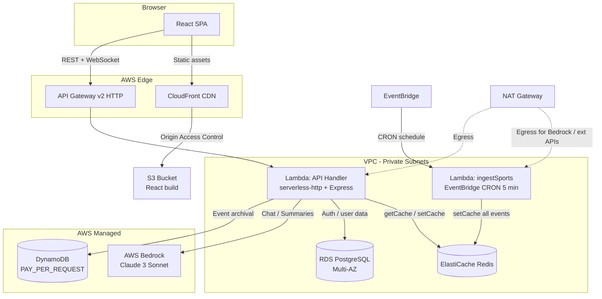

# Architecture Overview

Sports Monitor is a serverless, event-driven web application hosted on AWS. It is built around a **Redis-first read path**: a scheduled Lambda worker seeds ElastiCache with fresh sports data every 5 minutes, and all API reads are served from Redis with zero downstream database hits during normal operation.

---

## System Component Diagram



---

## 1. Frontend (React SPA)

Built with **React + Vite + TypeScript**. Key libraries:

| Library | Role |
|---|---|
| TailwindCSS | Utility-first styling |
| React-Leaflet | Interactive global map |
| Zustand | Client-side state (selected country, live events) |
| Axios | HTTP calls to the backend API |
| Socket.IO client | Real-time WebSocket updates |

On load, the app:
1. Calls `GET /api/sports/live` to hydrate the event store.
2. Establishes a WebSocket connection for push updates.
3. Renders `GlobalDashboard` by default; switches to `SportsPanel` when a country is selected on the map.

Deployed to **S3 + CloudFront** using **Origin Access Control (OAC)** — the S3 bucket is fully private and only accessible through CloudFront.

---

## 2. Backend API (Lambda + Express)

The Express application runs inside a **Lambda function** via the `serverless-http` adapter. It is placed inside **private VPC subnets** and reaches the internet (for AWS Bedrock and external APIs) through a single **NAT Gateway**.

### API Routes

| Prefix | Description |
|---|---|
| `POST /api/auth/*` | Registration, login, token refresh |
| `GET /api/sports/*` | Live events and country-filtered events (Redis-backed) |
| `GET /api/stats/*` | Country statistics and global heatmap |
| `POST /api/ai/*` | Bedrock chat, match summaries, predictions |
| `GET /api/user/*` | User profile and preferences |
| `GET /health` | Health check (DB + Redis status + memory metrics) |

### Redis Caching (Cache-Aside)

All sports and stats routes pass through the `cacheResponse` middleware:

1. On **cache hit**: return stored JSON + `Cache-Control: public, max-age=<ttl>` header immediately.
2. On **cache miss**: call next handler; wrap `res.json` to asynchronously write the response to Redis.
3. On **Redis error**: degrade gracefully — call `next()` without crashing.

### AI Service (Stateless)

`aiService.ts` calls AWS Bedrock directly. Conversation history is **not stored server-side** — callers supply prior turns per request. This is required because Lambda containers are ephemeral and may be recycled between invocations.

---

## 3. Sports Ingest Worker (CRON Lambda)

`ingestSports.ts` runs on an **EventBridge Scheduled Rule** every 5 minutes. It:

1. Stamps a fresh `Date.now()` timestamp on every invocation (never at module load).
2. Builds country-specific slices of the event list.
3. Writes all cache keys **in parallel** (`Promise.all`) to ElastiCache:
   - `sports_live_events` — full event list (TTL 300 s)
   - `sports_by_country:<country>` — per-country slice (TTL 300 s)

The API handler is a **pure read** from Redis; the CRON worker is the sole write path.

---

## 4. Database Tier

| Store | Purpose | Placement |
|---|---|---|
| **RDS PostgreSQL** (Multi-AZ) | User accounts, auth tokens, historic data | Private subnet via DB Subnet Group |
| **DynamoDB** (PAY_PER_REQUEST) | Live event archival, event sourcing | AWS-managed (no VPC needed) |
| **ElastiCache Redis** | Hot-path API cache; CRON-seeded sports data | Private subnet |

PostgreSQL enforces **SSL with `rejectUnauthorized: true`** in production. Pool size and timeouts are configurable via environment variables (`DB_POOL_MAX`, idle/connection timeouts).

---

## 5. Networking

```
VPC 10.0.0.0/16
├── Public Subnets  (us-east-1a/b/c) — Internet Gateway, NAT Gateway EIP
└── Private Subnets (us-east-1a/b/c) — Lambda, RDS, ElastiCache
    └── Route: 0.0.0.0/0 → NAT Gateway
```

A **single NAT Gateway** in the first public subnet handles all egress for resources in private subnets (Bedrock calls, external data APIs). This minimises cost while maintaining outbound connectivity.

---

## 6. Test Coverage

All layers enforce a **90% coverage threshold** (lines / functions / branches / statements):

| Layer | Test runner | Config |
|---|---|---|
| Backend | Vitest (node env) | `backend/vitest.config.ts` |
| Frontend | Vitest (jsdom env) | `frontend/vite.config.ts` |
| Terraform | Jest + `tf-helpers` | `terraform/test/*.test.ts` |

Checkov IaC scanning runs in CI with `soft-fail: false` and `hard-fail-on: [HIGH, CRITICAL]`.
