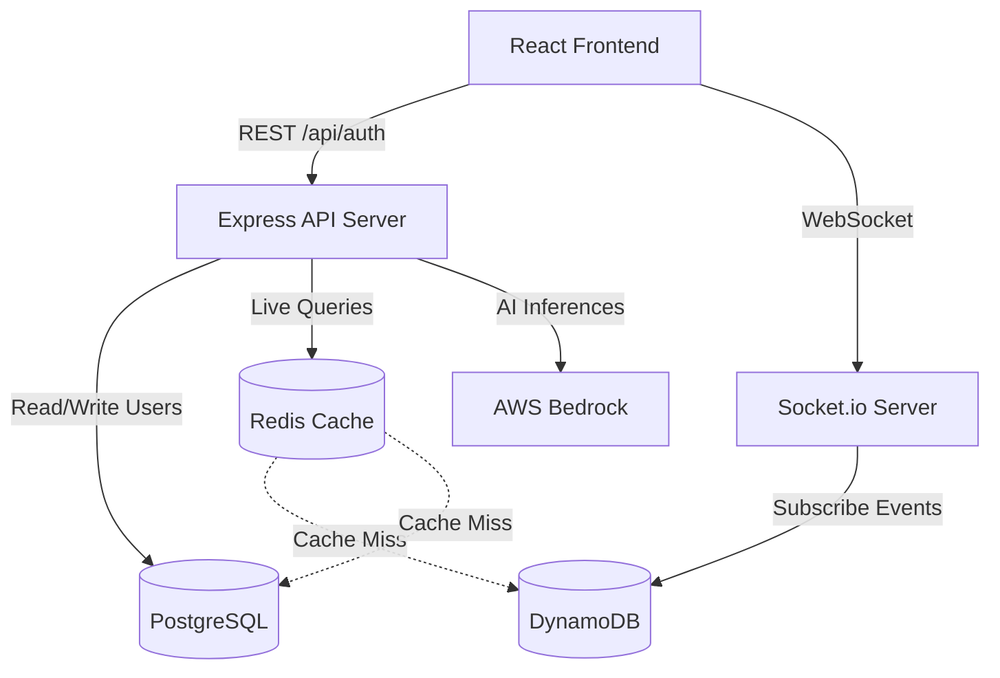

# Architecture Overview

This project is broken down into three logical layers: the **Frontend**, the **Backend**, and the **Database Tier**. It follows modern scalable architectures designed for real-time web applications.

## System Sequence & Component Diagram

## 1. The Frontend (Client)

The frontend is a single-page application built with React and Vite. Key libraries include:

- **TailwindCSS**: Used for rapid, utility-first styling.
- **React-Leaflet**: Renders the interactive global event map directly within the browser.
- **Zustand**: Manages global application state (like which country is currently selected, and caching localized sports data).

When a user visits the site, the client connects to the backend API to fetch live events and then establishes a permanent **WebSocket** connection for real-time updates pushed from the server.

## 2. The Backend API & WebSocket Server

The server is built in **Node.js** with **Express** and **TypeScript**, engineered for high availability and low latency. It serves two primary purposes:

1. **REST API (`/api/*`)**: Handled completely by Express. It connects to the database to resolve routes like `/api/auth/login` (Authentication) or `/api/sports/by-country` (Data fetching).
2. **WebSocket Server**: Powered by `Socket.io`. It pushes new match events down to connected clients whenever the database records a change in the active games. State is managed per connection to selectively broadcast updates based on user focus (e.g., watching a specific country).

_Note: This is also the layer that securely communicates with AWS Bedrock to provide AI summaries of the sports matches on demand._

## 3. The Database Tier

Because different data behaves differently, the application uses three specialized systems to efficiently manage information and maximize scalability:

- **PostgreSQL**: Stores relational, permanent data like Users, Roles, Passwords, and historic completion data.
- **DynamoDB**: An AWS NoSQL database that stores volatile, fast-moving "live-events". We use this because live sports data is heavily written and heavily read for short bursts of time before expiring (via a Time To Live feature).
- **Redis**: Caches heavy API responses (like retrieving the entire list of live matches) to dramatically relieve load on the downstream databases when thousands of users are connected simultaneously. The API tier always attempts a cache read before querying PostgreSQL or DynamoDB.
